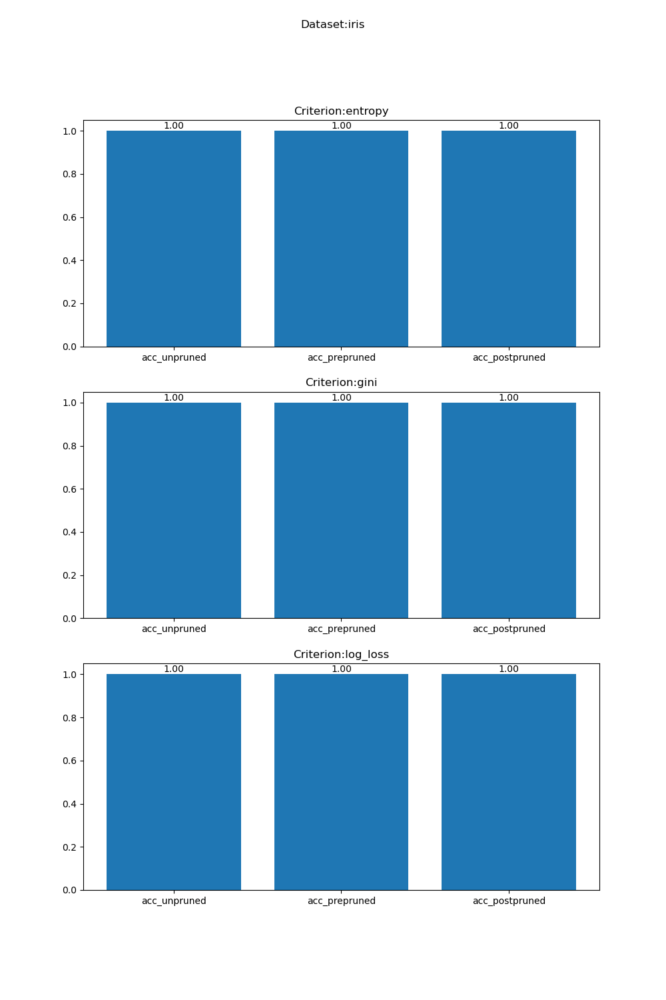

### 作业1实验报告
#### 020112713 李子轩 信息管理与信息系统

#### 数据集
本实验选用UCI数据集中选用了以下四个数据集进行实验：
* Adult
* Car 
* Iris
* Wine
#### 实验环境
1. Python==3.8
2. pands==1.5.3
3. scikit-learn==1.2.1
4. matplotlib==3.7.1
#### 实验方法
1. 数据读取与预处理

    首先对数据集进行读取，并进行一定的处理，将数据集中的非数值类转为数值类，以便于决策树模型拟合数据。
    
    在进行预处理后通过 `sklearn.model_selection` 划分训练集和测试集

    本实验中定义了 `read_data` 方法来读取、预处理、划分数据集，具体代码如下：

    ```python
    def read_data(dataset,path):
    data = pd.read_csv(path, header=None)

    if dataset=='adult':
        column_names = ["age", "workclass", "fnlwgt", "education", "education_num", "marital_status", "occupation",
                        "relationship", "race", "sex", "capital_gain", "capital_loss", "hours_per_week",
                        "native_country", "income"]

        adult_data = pd.read_csv(path, names=column_names, skipinitialspace=True)

        categorical_columns = ["workclass", "education", "marital_status", "occupation", "relationship", "race", "sex",
                               "native_country"]
        adult_data_encoded = pd.get_dummies(adult_data, columns=categorical_columns, drop_first=True)

        X = adult_data_encoded.drop("income", axis=1)
        y = adult_data_encoded["income"]

    elif dataset=='car':
        column_names = ["buying", "maint", "doors", "persons", "lug_boot", "safety", "class"]
        car_data = pd.read_csv(path, names=column_names)

        categorical_columns = ["buying", "maint", "doors", "persons", "lug_boot", "safety"]
        car_data_encoded = pd.get_dummies(car_data, columns=categorical_columns)

        X = car_data_encoded.drop("class", axis=1)
        y = car_data_encoded["class"]

    elif dataset=='iris':
        column_names = ["sepal_length", "sepal_width", "petal_length", "petal_width", "species"]
        iris_data = pd.read_csv(path, names=column_names)

        X = iris_data.drop("species", axis=1)
        y = iris_data["species"]

    elif dataset =='wine':
        wine_data = pd.read_csv(path, header=None)

        X = wine_data.iloc[:, 1:]
        y = wine_data.iloc[:, 0]

    else:
        print("不支持的数据集")

    X_train, X_test, y_train, y_test = train_test_split(X, y, test_size=0.2, random_state=42)

    return X_train, X_test, y_train, y_test
    ```

2. 模型定义与训练

    本次实验借助`sklearn`库中的决策树模型进行，对每个数据集都分别构建了未剪枝、预剪枝和后剪枝决策树，并对三种决策方法：信息增益、基尼指数和对数损失 分类的效果进行了比较。

    模型定义与训练代码如下：

    ```python
    def train(X_train,y_train,criterion):
    tree_unpruned = DecisionTreeClassifier(criterion=criterion)
    tree_unpruned.fit(X_train, y_train)


    tree_prepruned = DecisionTreeClassifier(criterion=criterion, max_depth=3)
    tree_prepruned.fit(X_train, y_train)

    def prune_index(inner_tree, index, threshold):
        if inner_tree.value[index].min() < threshold:
            inner_tree.children_left[index] = _tree.TREE_LEAF
            inner_tree.children_right[index] = _tree.TREE_LEAF

        if inner_tree.children_left[index] != _tree.TREE_LEAF:
            prune_index(inner_tree, inner_tree.children_left[index], threshold)
            prune_index(inner_tree, inner_tree.children_right[index], threshold)

    pruning_threshold = 0.05

    def prune_tree(tree, threshold):
        for index in range(tree.tree_.node_count):
            if tree.tree_.children_left[index] != tree.tree_.children_right[index]:
                left_child = tree.tree_.children_left[index]
                right_child = tree.tree_.children_right[index]

                info_gain = tree.tree_.impurity[index] - (
                            tree.tree_.weighted_n_node_samples[left_child] * tree.tree_.impurity[left_child] +
                            tree.tree_.weighted_n_node_samples[right_child] * tree.tree_.impurity[right_child]) / \
                            tree.tree_.weighted_n_node_samples[index]

                if info_gain < threshold:
                    tree.tree_.children_left[index] = tree.tree_.children_right[index] = -1

    tree_postpruned = DecisionTreeClassifier(criterion=criterion)
    tree_postpruned = tree_postpruned.fit(X_train, y_train)

    prune_tree(tree_postpruned, pruning_threshold)

    return tree_unpruned,tree_prepruned,tree_postpruned
    ```
    其中，`prune_tree`方法对决策树进行后剪枝，剪枝后的决策树是`tree_postpruned`，参数`criterion`为决策方法，可选参数有：`'entropy','gini','log_loss'`，分别对应：信息增益、基尼指数和对数损失。

3. 模型评估
    本实验采用Acc作为模型评估指标，对 **未剪枝、预剪枝和后剪枝决策树** 分别使用 **信息增益、基尼指数和对数损失** 作为决策方法，在 **Adult,Car,Iris,Wine** 四个数据集上进行评估。

    评估代码：
    ```python
    def eval(tree_unpruned,tree_prepruned,tree_postpruned,\
    X_test,y_test):
    acc_unpruned = accuracy_score(y_test, tree_unpruned.predict(X_test))
    acc_prepruned = accuracy_score(y_test,tree_prepruned.predict(X_test))
    acc_postpruned = accuracy_score(y_test,tree_postpruned.predict(X_test))
    return acc_unpruned,acc_prepruned,acc_postpruned
    ```

4. Main
    
    运行 code/main.py 即可得到试验结果
    主程序代码：
    ```python
    datasets = ['adult','car','iris','wine']
    criterions = ['entropy','gini','log_loss']
    ans = {}
    for dataset in datasets:
        sub_ans = {}
        data_file = dataset+'.data'
        data_path = os.path.join('../datasets',dataset,data_file)
        X_train, X_test, y_train, y_test = read_data(dataset,data_path)
        for criterion in criterions:
            sub_sub_ans = {}
            tree_unpruned,tree_prepruned,tree_postpruned = train(X_train,y_train,criterion)
            sub_sub_ans['acc_unpruned'], sub_sub_ans['acc_prepruned'], sub_sub_ans['acc_postpruned'] = eval(tree_unpruned,tree_prepruned,tree_postpruned,X_test,y_test)
            sub_ans[criterion] = sub_sub_ans
        ans[dataset] = sub_ans

    print(ans)
    for i,dataset in enumerate(ans.keys()):
        plt.figure(figsize=(10, 15))
        for j,criterion in enumerate(ans[dataset].keys()):
            plt.subplot(len(ans[dataset].keys()),1,j+1)
            x = ans[dataset][criterion].keys()
            y = []
            for item in ans[dataset][criterion]:
                y.append(ans[dataset][criterion][item])
            print(y)
            plt.title(f'Criterion:{criterion}')
            plt.bar(x, y)
            for a, b, i in zip(x, y, range(len(x))):
                plt.text(a, b + 0.01, "%.2f" % y[i], ha='center', fontsize=10)
        plt.suptitle(f"Dataset:{dataset}")
        plt.savefig(f"../Ans/{dataset}_Ans.png",dpi=100)
        plt.show()

    ```
#### 实验结果

1. Adult数据集上的实验结果
    

2. Car数据集上的实验结果
    

3. Iris数据集上的实验结果
    

4. Wine数据集上的实验结果
    

#### 分析

通过上述实验结果可见，在相同数据集上，无论使用哪种决策策略、是否对决策树进行剪枝，预剪枝还是后剪枝，取得的Acc相差不大

通常来说，使用预剪枝可以降低过拟合风险，增加欠拟合风险；使用后剪枝可以降低过拟合风险，欠拟合风险基本不变。本实验取得上述实验结果的原因极有可能是因为数据集样本数过少。