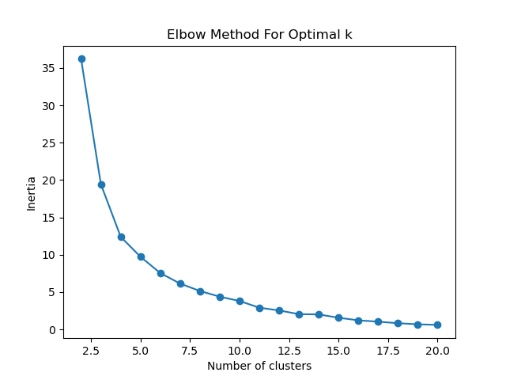
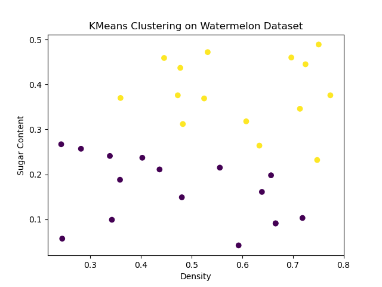
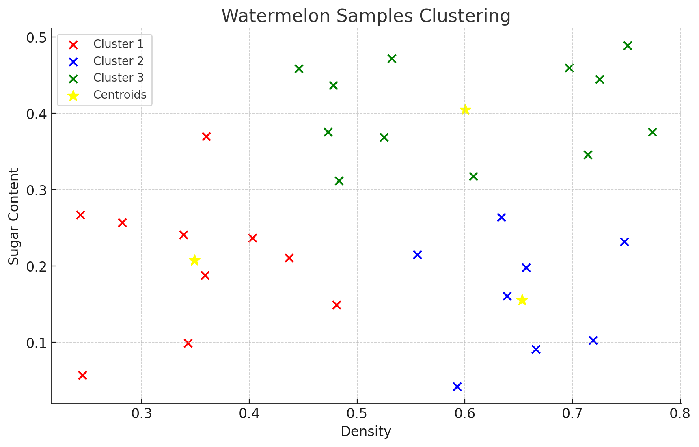

### 作业5实验报告
#### 0201121713 李子轩 信息管理与信息系统
#### 数据集
本实验选用西瓜数据集4.0进行实验
#### 实验环境
1. Python==3.8
2. matplotlib==3.7.1
3. scikit-learn==1.2.1
#### 实验方法
1. 数据预处理

    首先对西瓜数据集4.0进行了标准化处理
    ```python
    scaler = StandardScaler()
    melon_data_scaled = scaler.fit_transform(melon_data)
    ```
2. Elbow方法

   根据不同聚类数的惯性（Inertia）值，衡量样本点到聚类中心的距离的总和，选择最佳的聚类数。 

   通过绘制肘部图，展示不同聚类数下的惯性值，选择惯性值下将开始变缓的点作为最佳聚类数

   ```python
   # 聚类数范围
   cluster_range = range(2, 11)
   
   # 评估每个聚类数的轮廓系数
   inertia_values = []
   for k in cluster_range:
       kmeans = KMeans(n_clusters=k, random_state=42)
       kmeans.fit(melon_data_scaled)
       inertia_values.append(kmeans.inertia_)
   
   # 绘制肘部方法图
   plt.plot(cluster_range, inertia_values, marker='o')
   plt.xlabel('Number of clusters')
   plt.ylabel('Inertia')
   plt.title('Elbow Method For Optimal k')
   plt.show()
   
   # 选择最佳聚类数
   best_k = np.argmin(np.diff(inertia_values)) + 2
   print("Best number of clusters:", best_k)
   ```

3. 用最佳聚类数进行聚类并可视化结果
   
   ```python
   # 使用最佳聚类数进行聚类
   kmeans_final = KMeans(n_clusters=best_k, random_state=42)
   final_clusters = kmeans_final.fit_predict(melon_data_scaled)
   
   # 可视化最终聚类结果
   plt.scatter(melon_data[:, 0], melon_data[:, 1], c=final_clusters, cmap='viridis', marker='o')
   plt.xlabel('Density')
   plt.ylabel('Sugar Content')
   plt.title('KMeans Clustering on Watermelon Dataset')
   plt.show()
   ```

#### 实验结果

   根据绘制的不同聚类数的惯性（Inertia）值图，我们选择2为最佳聚类数
   
   
   得到的聚类结果：

   

   在假设最佳聚类结果为3时，得到的簇中心以及各类数据分布情况：

   黄色点为簇的中心，红绿蓝三色点分别代表不同类别的数据

   