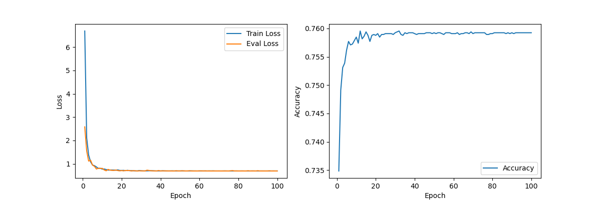
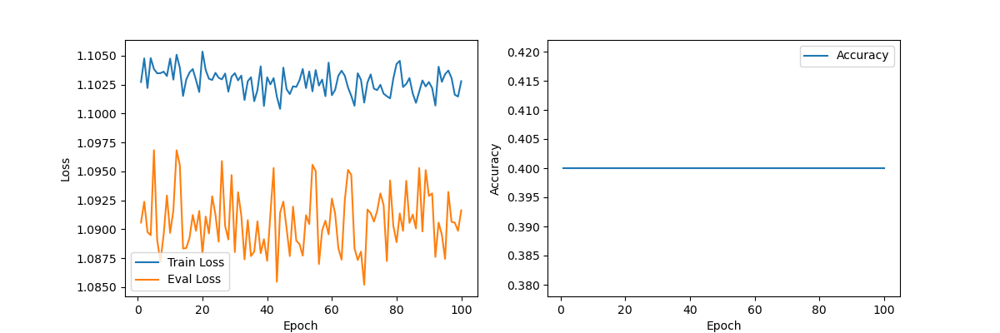

### 作业2实验报告
#### 0201121713 李子轩 信息管理与信息系统
#### 数据集
本实验选用UCI数据集中选用了以下四个数据集进行实验：
* Adult
* Car 
* Iris
* Wine
#### 实验环境
1. Python==3.8
2. numpy==1.23.1
3. scikit-learn==1.2.1
4. torch==1.21.1
5. matplotlib==3.7.1
6. pandas==1.5.3
#### 实验方法
1. 数据读取与预处理

    对数据集进行读取，并对数据集进行划分，将数据的80%划分为训练集，20%划分为测试集。本实验中在`utils`中定义了`split_train_and_test`方法进行数据集分割
    ```python
    def split_train_and_test(data_path):
    df = pd.read_csv(data_path,header=None)
    df = df.sample(frac=1, random_state=42)
    train_data = df.iloc[:int(0.8 * len(df))]
    test_data = df.iloc[int(0.8 * len(df)):]
    floder_path = os.path.dirname(data_path)
    train_data_path = os.path.join(floder_path,'train.data')
    test_data_path = os.path.join(floder_path,'test.data')
    train_data.to_csv(train_data_path,index=False,header=None)
    test_data.to_csv(test_data_path,index=False,header=None)
    ```
    本实验通过重载`torch.utils`中的`Dataset`类，使用`torch.utils.Dataloader`进行数据集的读取。将数据集中的非数值类型转化为数值类。

    ```python
    class MyDataset(Dataset):
    def __init__(self,dataset,data_path):
        self.dataset = dataset
        self.data_path = data_path
        self.label_encoder = LabelEncoder()
        self.data = pd.read_csv(self.data_path,header=None)
        if dataset == 'iris':
            self.data[4] = self.label_encoder.fit_transform(self.data[4])
            self.data = np.array(self.data)
            self.data = torch.tensor(self.data).to(torch.float32)
        elif dataset == 'adult':
            text_cols = [1,3,5,6,7,8,9,13,14]
            for i in text_cols:
                self.data[i] = self.label_encoder.fit_transform(self.data[i])
            self.data = np.array(self.data)
            self.data = torch.tensor(self.data).to(torch.float32)
        elif dataset == 'car':
            text_cols = [0,1,2,3,4,5,6]
            for i in text_cols:
                self.data[i] = self.label_encoder.fit_transform(self.data[i])
            self.data = np.array(self.data)
            self.data = torch.tensor(self.data).to(torch.float32)
        elif dataset == 'wine':
            self.data[0] = self.label_encoder.fit_transform(self.data[0])
            self.data = np.array(self.data)
            self.data = torch.tensor(self.data).to(torch.float32)

    def __len__(self):
        return len(self.data)

    def __getitem__(self, idx):
        if not self.dataset == 'wine':
            x = self.data[idx,:-1]
            y = self.data[idx,-1]
        else:
            x = self.data[idx,1:]
            y = self.data[idx,0]
        return x,y
    ```

2. 模型结构

    本实验为了探究不同大小模型对试验结果的影响，提供了两个模型进行实验，均为多层感知机。模型1命名为`MLP`，模型2命名为`MLP_mini`，MLP和MLP_mini所具有的隐藏层数不同，MLP的参数量大于MLP_mini。模型结构见以下代码：
    ```python
    class MLP(nn.Module):
    def __init__(self,in_dim,out_dim):
        super(MLP, self).__init__()
        self.fc1 = nn.Linear(in_dim, 32)
        self.fc2 = nn.Linear(32, 64)
        self.fc3 = nn.Linear(64,128)
        self.fc4 = nn.Linear(128,256)
        self.fc5 = nn.Linear(256,128)
        self.fc6 = nn.Linear(128,64)
        self.fc7 = nn.Linear(64,32)
        self.fc8 = nn.Linear(32,out_dim)

    def forward(self, x):
        x = torch.relu(self.fc1(x))
        x = nn.Dropout(0.2)(x)
        x = torch.relu(self.fc2(x))
        x = nn.Dropout(0.2)(x)
        x = torch.relu(self.fc3(x))
        x = nn.Dropout(0.2)(x)
        x = torch.relu(self.fc4(x))
        x = nn.Dropout(0.2)(x)
        x = torch.relu(self.fc5(x))
        x = nn.Dropout(0.2)(x)
        x = torch.relu(self.fc6(x))
        x = nn.Dropout(0.2)(x)
        x = torch.relu(self.fc7(x))
        x = nn.Dropout(0.2)(x)
        x = torch.relu(self.fc8(x))

        return x
    ```

    ```python
    class MLP_mini(nn.Module):
    def __init__(self,in_dim,out_dim):
        super(MLP_mini, self).__init__()
        self.fc1 = nn.Linear(in_dim, 64)
        self.fc2 = nn.Linear(64, out_dim)

    def forward(self, x):
        x = torch.relu(self.fc1(x))
        x = self.fc2(x)
        return x
    ```
    传入参数`in_dim`,`out_dim`是为了让网络能适应多个不同的数据集，根数据集的具体情况构建输入蹭喝输出层。

3. 模型训练与评估
    本实验选用交叉熵损失函数和Adam优化器，学习率设置为1e-5
    训练代码：
    ```python
    model.train()
    train_loss = 0.0
    for feature,label in train_loader:
        feature = feature.to(device=device, dtype=torch.float32)
        label = label.to(device=device, dtype=torch.int64)
        optimizer.zero_grad()
        output = model(feature)
        loss = criterion(output,label)
        loss.backward()
        optimizer.step()
        train_loss += loss.item()
    train_loss /= len(train_loader)
    train_loss_record.append(train_loss)
    ```
    本次实验中使用Acc作为评估标准，每个epoch都对模型进行一次评估
    评估代码：
    ```python
    model.eval()
    eval_loss = 0.0
    total = 0
    correct = 0
    with torch.no_grad():
        for feature,label in test_loader:
            feature = feature.to(device=device, dtype=torcfloat32)
            label = label.to(device=device, dtype=torch.int64)
            output = model(feature)
            loss = criterion(output,label)
            _,predicted = torch.max(output, 1)
            eval_loss += loss.item()
            total += label.size(0)
            correct += (predicted == label).sum().item()
        acc = correct / total
        acc_record.append(acc)
        total = 0
        correct = 0
    eval_loss /= len(test_loader)
    eval_loss_record.append(eval_loss)
    ```

#### 实验结果

1. MLP实验结果
    * Adult数据集
        
    * Car数据集
        
    * Iris数据集
        
    * Wine数据集
        

2. MLP_mini试验结果
    * Adult数据集
        
    * Car数据集
        
    * Iris数据集
        
    * Wine数据集
        

#### 实验分析

1. 
    从Iris数据集和Wine数据集在MLP模型上的表现十分糟糕，原因是Iris数据集和Wine数据集均只有一百多条数据，难以用如此小的数据量训练复杂的神经网络模型，给出的数据量不足以支持神经网络学习到有用的信息。

    在换用MLP_mini模型后，虽然参数量减小，但无法从数据中学习到足够信息的情况依然存在

2. 
    通过对比Car数据集在MLP模型和MLP_mini模型上的表现，可以看出，MLP_mini模型在Car数据集上欠拟合，即模型结构过于简单，无法表示数据中潜在的模式。

3. 
    拥有十万余条数据的Adult数据集无论是在MLP模型上还是MLP_mini模型上，都取得了理想的成绩，这是因为Adult的样本数量足够多，模型能够在数据集上学习到足够的模式信息。

4. 
    本实验中Iris数据集和Wine数据集表现不理想的原因也可能是过拟合导致的